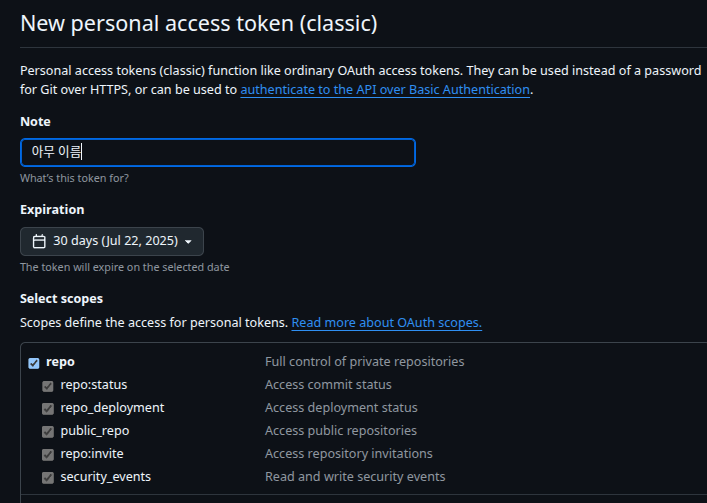
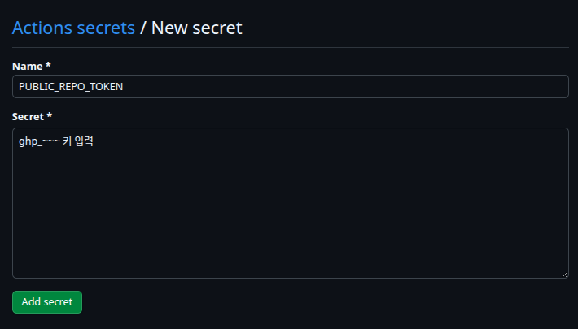
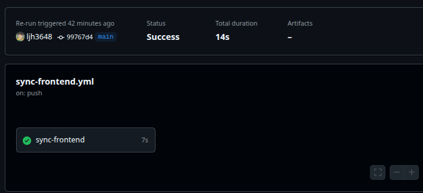
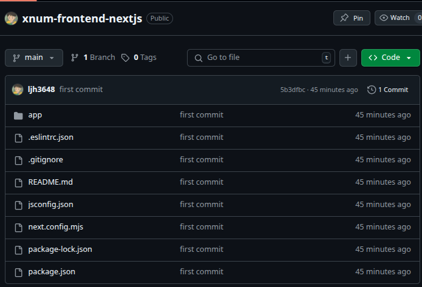
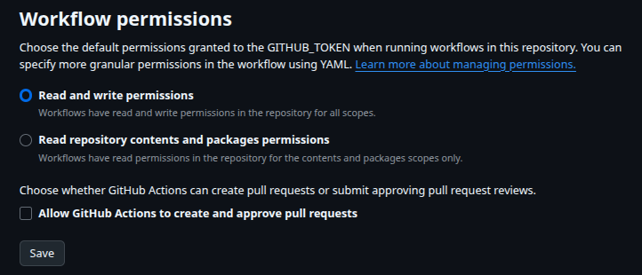

# Private 레포에서 특정 디렉토리만 Public 레포로 자동 동기화하기

> Action을 통해서 **Private 레포**에서 **특정 디렉토리**의 내용만 **다른 저장소의 Public 레포**에 접근하여 커밋할 때 사용됨. 

## 자동 동기화 과정

### PAT(personal access token)발급.
Setting - > Developer Settings ->  Personal access token -> Generate new token



Select scopes에 repo 체크!

키 생성 후 ghp_~~~~ 키를 보관한다.

### Private 레포에 Action secrets 추가

Private 레포 접속

Setting -> Secrets and Variables -> Actions -> New repository secret


PAT키를 저장한다.

### Workflows 설정

```yml
name: Sync Frontend to Public Repo

on:
  push:
    branches: [main]
    paths:
      - "frontend/**" # Private 레포에서 frontend 부분만

jobs:
  sync-frontend:
    runs-on: ubuntu-latest
    permissions:
      contents: write
      pages: write
    steps:
      - name: Checkout private repo
        uses: actions/checkout@v3
        with:
          fetch-depth: 0
          persist-credentials: false # GitHub_Token을 사용하지 않음 이거 중요함
      - name: Push frontend subtree
        run: | 
          git config --global user.name "github-actions[bot]"
          git config --global user.email "github-actions[bot]@users.noreply.github.com"
          git subtree split --prefix frontend -b gh-pages-sync
          git push \
            https://{유저명}:${{ secrets.PUBLIC_REPO_TOKEN }}@github.com/{유저명}/{Public 레포}.git \
            gh-pages-sync:main --force
```

### 결과
Private 레포에 커밋하면 Action Workflows 작동


자동으로 Public 레포에 FrontEnd부분만 커밋이 되는걸 확인할 수 있다!!


만약 Action에서 public 레포에 접근권한을 얻지 못하면 레포에서 Setting -> Action
에서 읽기 쓰기 권한을 허용한다.



## TIL

### 배경
XNUM 프로젝트에서 Backend에는 통신사 API관련된 정보가 포함되어 있어 비공개로 관리하려하는데

Frontend는 오픈소스로 공개하고 싶었다.

### 문제
두 개의 레포를 따로 관리하면 레포 동기화가 번거로운 문제가 있다.

### 해결
Private 레포(xnum)에 Frontend 코드를 frontend/ 디렉토리에 분리하고

GitHub Actions 워크플로우 작성하여서

frontend/ 코드 변경내용만 감지한다.

git subtree split --prefix frontend 로 해당 디렉토리 히스토리만 분리해서

퍼블릭 레포(xnum-nextjs)의 main 브랜치로 강제 푸시한다.

결과적으로 프론트엔드 코드만 퍼블릭 레포에 자동 배포가 된다.


