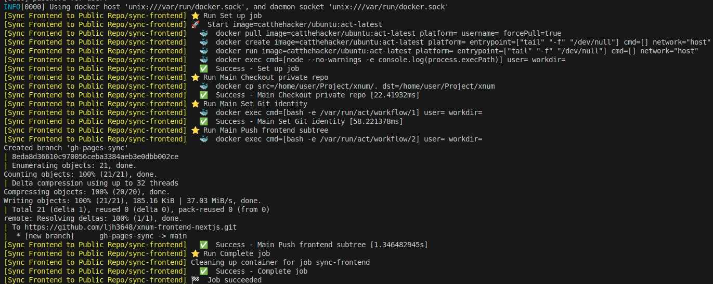

# act
GitHub Action Workflow를 로컬환경에서 실행할 수 있다. 

https://github.com/nektos/act

## 설치 방법
Docker가 설치되어 있어야 한다.
```bash
curl --proto '=https' --tlsv1.2 -sSf https://raw.githubusercontent.com/nektos/act/master/install.sh | sudo bash
```

## ACT를 사용하게 된 배경
GitAction에 미숙한 나는 Action이 잘 될때까지 무한으로 커밋한다. ~~그러면 깃허브 잔디가 푸릇해진다 ^^~~

YML파일을 무작정 수정하여 커밋을 해볼 수 없으니, GitAction을 로컬환경에서 먼저 테스트 해보고 커밋을 하는 방법을 시도해본다.

## 문제 해결
Private 레포(xnum)에 Frontend 코드를 frontend/ 디렉토리에 분리하고

GitHub Actions 워크플로우 작성하여서

frontend/ 코드 변경내용만 감지한다.

git subtree split --prefix frontend 로 해당 디렉토리 히스토리만 분리해서

퍼블릭 레포(xnum-nextjs)의 main 브랜치로 강제 푸시한다.

결과적으로 프론트엔드 코드만 퍼블릭 레포에 자동 배포가 된다.


## 과정

실행할 Workflows를 입력하여 명령 실행
```bash
$ sudo env "PATH=$PATH" act push
```



이제 로컬환경에서 Action Wokrflows를 실행해볼 수 있다!

하지만, GitHub Action처럼 완벽하게 동일하지 않다.